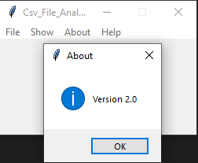

# CSV_FILE_ANALYSIS_V2

# FILE MENU

## Insert a csv file

You can insert a csv file using menu File --> Insert a csv file or using Ctrl+o keybind

if you insert a csv an success message pops up

else an error message pops up

## Close file

You can close a file using File --> Close file or using Cltr+F4 keybind

if there is no open csv file an error message pops up

else a success message pops up 

## Exit

You can close the app by using menu File --> Exit or using Alt+F4 keybind

 

An informative message pops up

 

You press ok to close the app or cancel if you don't want

# About menu

You can show info about the app by using menu About --> About or using Ctrl+i keybind

An informative message pops up

 

# Help menu

You can show info about the app by using menu Help --> Help or using Alt+F1 keybind

An informative message pops up

 